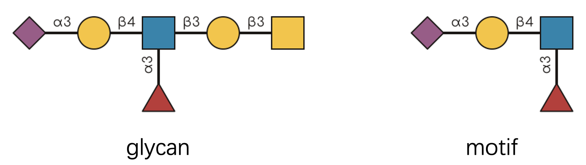

# Getting Started with glymotif

## What is a Glycan Motif? 🧬

Imagine you’re looking at a complex glycan structure—those intricate
branched molecules that decorate your cells. Hidden within these
molecular architectures are recurring patterns called “motifs.” Think of
them as the molecular equivalent of architectural motifs: recognizable
design elements that appear across different buildings (or in this case,
different glycans).

A glycan motif is simply a substructure that appears in multiple
glycans. (Don’t confuse this with protein motifs—we’re talking about
carbohydrates here! 🍭) Some famous examples include the N-glycan core,
Lewis X antigen, and the Tn antigen.

## Why Should You Care? 🤔

Here’s where it gets exciting: these motifs aren’t just
decorative—they’re functional. They determine how cells interact, how
pathogens bind, and how your immune system recognizes friend from foe.

This package, `glymotif`, is your computational microscope 🔬 for
advanced glycan motif analysis. It helps you answer two fundamental
questions:

- **Does this glycan contain a specific motif?**
- **How many times does this motif appear?**

The best part? ✨ Everything works with vectors of glycans, so you can
analyze hundreds or thousands at once.

**Important note:** This package builds on the powerful
[glyrepr](https://github.com/glycoverse/glyrepr) package. If you haven’t
used it before, we highly recommend checking out its
[introduction](https://glycoverse.github.io/glyrepr/articles/glyrepr.html)
first.

``` r
library(glymotif)
```

## A Quick Challenge 🧩

Let’s start with a visual puzzle. Can you tell if the glycan on the left
contains the motif on the right?



If you said “yes,” congratulations—you have a keen eye! 👀 But what if I
gave you 500 glycans and 20 motifs to check? That’s where `glymotif`
becomes indispensable.

Let’s see it in action using IUPAC-condensed notation (the standard text
format for glycans in the `glycoverse` ecosystem). If this notation
looks unfamiliar, don’t worry—check out [this helpful
guide](https://glycoverse.github.io/glyrepr/articles/iupac.html) first.

``` r
glycans <- c(
  "Neu5Ac(a2-3)Gal(b1-3)[Fuc(a1-6)]GlcNAc(b1-3)Gal(b1-3)GalNAc(b1-",
  "Neu5Ac(a2-?)Gal(b1-3)[Fuc(a1-6)]GlcNAc(b1-",
  "Man(b1-4)GlcNAc(b1-4)[Fuc(a1-3)]GlcNAc(b1-",
  "Gal(b1-3)GalNAc(b1-",
  "Neu5Ac9Ac(a2-3)Gal(b1-4)GlcNAc(b1-"
)
motif <- "Neu5Ac(a2-3)Gal(b1-3)[Fuc(a1-6)]GlcNAc(b1-"
have_motif(glycans, motif)
#> [1]  TRUE FALSE FALSE FALSE FALSE
```

Pretty neat, right? 😎

## Your Toolkit: Four Essential Functions 🛠️

`glymotif` provides four core functions that work together like a
well-designed instrument panel:

- **[`have_motif()`](https://glycoverse.github.io/glymotif/reference/have_motif.md)**:
  Returns TRUE/FALSE for each glycan—does it contain the motif?
- **[`count_motif()`](https://glycoverse.github.io/glymotif/reference/count_motif.md)**:
  Returns numbers—how many times does the motif appear?
- **[`have_motifs()`](https://glycoverse.github.io/glymotif/reference/have_motif.md)**:
  The plural version—checks multiple motifs at once, returns a matrix
- **[`count_motifs()`](https://glycoverse.github.io/glymotif/reference/count_motif.md)**:
  Counts multiple motifs simultaneously, returns a matrix

### Why the Plural Functions? 🤷‍♀️

You might wonder: “Why not just use
[`have_motif()`](https://glycoverse.github.io/glymotif/reference/have_motif.md)
in a loop?” Great question! 💭 There are two compelling reasons:

**1. Predictable output format** 📊 Just like the `purrr` package has
different `map` functions for different return types, our functions
guarantee consistent outputs. The singular functions return vectors; the
plural functions return matrices. No surprises, no wrestling with data
types.

**2. Optimized performance** ⚡ The plural functions are specifically
optimized for multiple motifs. They’re significantly faster than looping
or using
[`purrr::map()`](https://purrr.tidyverse.org/reference/map.html) because
they avoid redundant computations.

### Seeing Them in Action

Let’s define some motifs to work with:

``` r
motifs <- c(
  "Neu5Ac(a2-3)Gal(b1-3)[Fuc(a1-6)]GlcNAc(b1-",
  "Fuc(a1-",
  "Gal(b1-3)GalNAc(b1-"
)
```

All functions follow the same pattern:

- **First argument:** your glycans (as IUPAC strings or a
  [`glyrepr::glycan_structure()`](https://glycoverse.github.io/glyrepr/reference/glycan_structure.html)
  object)
- **Second argument:** your motif(s) (IUPAC strings, a
  [`glyrepr::glycan_structure()`](https://glycoverse.github.io/glyrepr/reference/glycan_structure.html)
  object, or predefined motif names)

``` r
have_motif(glycans, motif)
#> [1]  TRUE FALSE FALSE FALSE FALSE
```

``` r
unname(have_motifs(glycans, motifs))  # Removing names for cleaner display
#>       [,1]  [,2]  [,3]
#> [1,]  TRUE  TRUE  TRUE
#> [2,] FALSE  TRUE FALSE
#> [3,] FALSE  TRUE FALSE
#> [4,] FALSE FALSE  TRUE
#> [5,] FALSE FALSE FALSE
```

**Pro tip:** 💡 You don’t need to memorize complex IUPAC strings! Use
predefined motif names instead:

``` r
all_motifs()[1:10]
#>  [1] "Blood group H (type 2) - Lewis y" "i antigen"                       
#>  [3] "LacdiNAc"                         "GT2"                             
#>  [5] "Blood group B (type 1) - Lewis b" "LcGg4"                           
#>  [7] "Sialosyl paragloboside"           "Sialyl Lewis x"                  
#>  [9] "A antigen (type 3)"               "Type 1 LN2"
```

``` r
have_motif(glycans, "Type 2 LN2")
#> [1] FALSE FALSE FALSE FALSE FALSE
```

## The Art and Science of Motif Matching 🎨🔬

Now we enter the fascinating complexity of motif recognition. You might
think: “It’s just pattern matching, right?” Well, not quite. 🤨

Real-world glycan data is beautifully messy:

- **Missing linkage information**: Sometimes we only know “there’s a
  link” but not its exact type
- **Generic monosaccharides**: Mass spectrometry might only tell us
  “Hex” instead of “Glucose”
- **Chemical modifications**: Sulfation, acetylation, and other
  decorations add complexity
- **Alignment constraints**: Some motifs only “count” when they appear
  in specific locations

Consider the Tn antigen—it’s just a single GalNAc residue. But it
shouldn’t match every GalNAc in a complex N-glycan, should it? Context
matters.

Similarly, an O-glycan core motif should only be recognized at the
reducing end, not buried in the middle of a structure.

`glymotif` handles all these complexities through its sophisticated
matching engine. The algorithm considers structural context, chemical
modifications, and biological relevance to make intelligent matching
decisions.

## Handling Structural Ambiguity 🤔

Real-world glycan data often comes with structural ambiguity. Mass
spectrometry might only tell us “HexNAc” instead of “GlcNAc”, or linkage
analysis might yield “a1-?” instead of “a1-6”. These uncertainties are
common in experimental glycomics and glycoproteomics.

`glymotif` handles these ambiguities with a fundamental principle: **A
glycan cannot be more ambiguous than the motif it’s being matched
against.**

``` r
# Ambiguous linkages won't match specific ones
have_motif("Gal(??-?)GalNAc(??-", "Gal(a1-6)GalNAc(a1-")
#> [1] FALSE

# Generic monosaccharides won't match specific ones
have_motif("Hex(a1-6)HexNAc(a1-", "Gal(a1-6)GalNAc(a1-")
#> [1] FALSE
```

This behavior is **intentional**, not a bug. ✨ True motif
identification requires confidence: structural possibilities alone
aren’t sufficient evidence.

### Working Around Ambiguity

If you’re getting unexpected `FALSE` results with
[`have_motif()`](https://glycoverse.github.io/glymotif/reference/have_motif.md)
(especially when using built-in motifs with ambiguous glycans), here are
two strategies:

**1. Ignore linkage information** when linkages are unreliable:

``` r
have_motif("Gal(??-?)GalNAc(??-", "Gal(a1-6)GalNAc(a1-", ignore_linkages = TRUE)
#> [1] TRUE
```

**2. Convert motifs to generic forms** to match the generic
monosaccharides of your data:

``` r
motif <- glyparse::auto_parse("Gal(a1-6)GalNAc(a1-")  # First, create a `glycan_structure()`
motif <- glyrepr::convert_to_generic(motif)  # Then, convert to generic
have_motif("Hex(a1-6)HexNAc(a1-", motif)
#> [1] TRUE
```

⚠️ **Important:** When using these workarounds, interpret your results
with appropriate caution. You’re trading specificity for coverage.

## What’s next?

- Want to known all the details about motif matching rules?
  [Here](https://glycoverse.github.io/glymotif/articles/motif-matching.html)
- Working with
  [`glyexp::experiment()`](https://glycoverse.github.io/glyexp/reference/experiment.html)?
  [Here](https://glycoverse.github.io/glymotif/articles/with-exp.html)

## Standing on the Shoulders of Giants 🏔️

This work wouldn’t be possible without the inspiration and groundwork
laid by several excellent projects:

- [glycowork](https://github.com/BojarLab/glycowork): A comprehensive
  Python toolkit for glycan analysis 🐍
- [GlyCompare](https://github.com/LewisLabUCSD/GlyCompare): Advanced
  glycan comparison algorithms 🔬

We’re proud to contribute to this growing ecosystem of computational
glycobiology tools! 🌱
