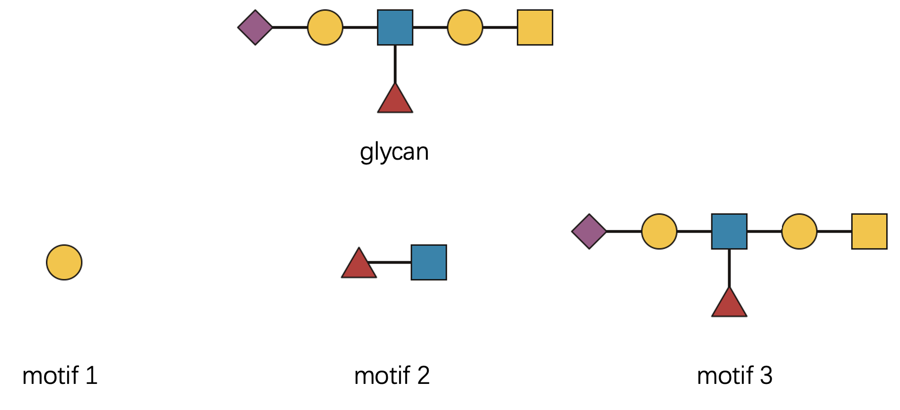
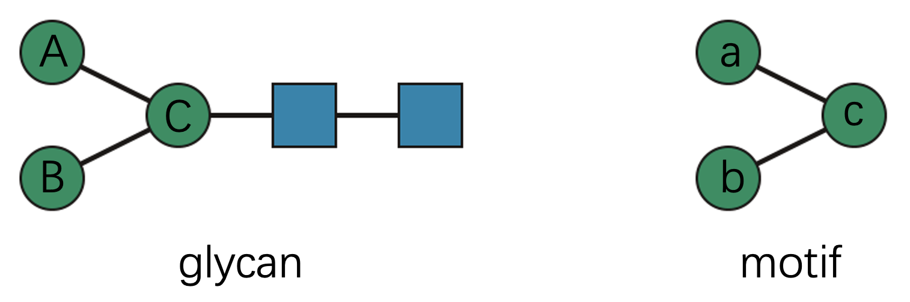
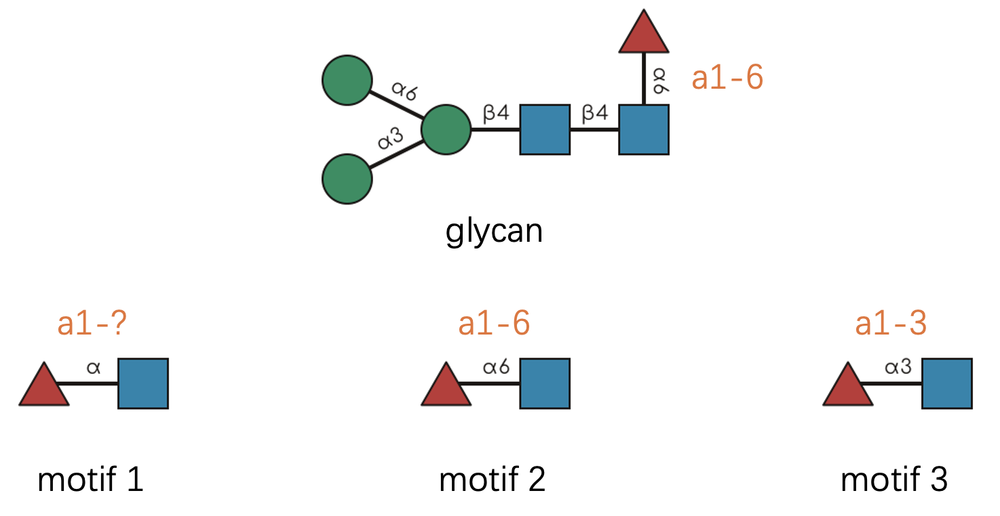
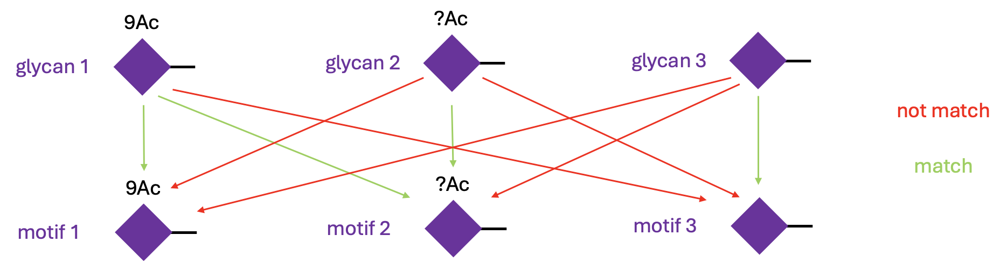
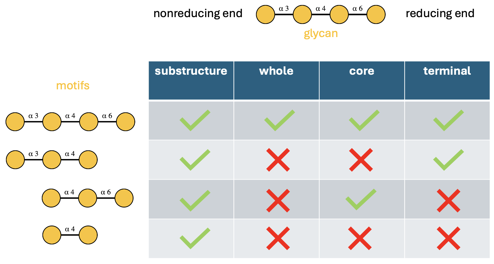

# The Science Behind Motif Matching

## How Motif Matching Works

This vignette explains what happens when you call
[`have_motif()`](https://glycoverse.github.io/glymotif/reference/have_motif.md)
or
[`count_motif()`](https://glycoverse.github.io/glymotif/reference/count_motif.md).

In this vignette, we describe the matching rules that power all
`glymotif` functions. The rules are rooted in the comprehensive
[GlycoMotif](https://glycomotif.glyomics.org/) database, and adapted for
practical glycan analysis workflows.

**A quick note:** We use IUPAC-condensed glycan text representations
throughout. If this format is unfamiliar, start with [this
primer](https://glycoverse.github.io/glyrepr/articles/iupac.html).

``` r

library(glymotif)
```

## Defining Our Terms

Before diving into the technical details, let’s establish some clarity
about what we’re actually matching.

Throughout this vignette, **“glycan”** refers to a complete carbohydrate
structure—the whole molecular tree, from its reducing end (often
attached to proteins or lipids) to its non-reducing termini.

**“Motif”**, on the other hand, is any structurally meaningful pattern
within that tree. It could be:

- A single monosaccharide
- A small oligosaccharide unit
- An entire glycan structure

Our central question is simple: **Does the given glycan contain this
particular motif?**

Let’s start with a visual example that illustrates this concept:


Looking at this diagram, we can confidently say “the glycan contains the
motif with exactly 1 occurrence.” The presence part is determined by
[`have_motif()`](https://glycoverse.github.io/glymotif/reference/have_motif.md),
while the counting aspect is handled by
[`count_motif()`](https://glycoverse.github.io/glymotif/reference/count_motif.md).

``` r

glycan <- "Neu5Ac(a2-3)Gal(b1-3)[Fuc(a1-6)]GlcNAc(b1-3)Gal(b1-3)GalNAc(b1-"
motif <- "Neu5Ac(a2-3)Gal(b1-3)[Fuc(a1-6)]GlcNAc(b1-"

print(paste0("Does the glycan have the motif? ", have_motif(glycan, motif)))
#> [1] "Does the glycan have the motif? TRUE"
print(paste0("How many occurrences of the motif are there in the glycan? ", count_motif(glycan, motif)))
#> [1] "How many occurrences of the motif are there in the glycan? 1"
```

## Why Not Just Use `str_detect()`?

You might be thinking: “This example looks straightforward—why not just
use string matching?” Let’s test that hypothesis:

``` r

stringr::str_detect(glycan, stringr::fixed(motif))
#> [1] TRUE
```

Indeed, it works for this simple case. But string matching does not
handle the common complications in glycan data.

Real-world glycan analysis is often complex. Consider these challenging
scenarios:

- **Complex branching patterns** with multiple attachment points
- **Ambiguous linkage annotations** where details are missing or
  uncertain
- **Generic monosaccharide assignments** from mass spectrometry data
- **Chemical modifications and substituents** that add complexity
- **Positional constraints** where context determines biological meaning
- **Reducing end anomers** that affect molecular recognition

Writing regular expressions to handle all these nuances? That becomes
difficult to maintain quickly. That is why `glymotif` uses glycan-aware
matching rules.

## Matching Rules

The
[`have_motifs()`](https://glycoverse.github.io/glymotif/reference/have_motif.md)
and
[`count_motifs()`](https://glycoverse.github.io/glymotif/reference/count_motif.md)
functions return matrices with meaningful row and column names. For
clarity in our demonstrations, let’s create simplified wrapper
functions:

``` r

# You don't have to understand this.
have_motifs_simple <- function(glycan, motifs, ...) {
  unname(have_motifs(glycan, motifs, ...)[1, ])
}

count_motifs_simple <- function(glycan, motifs, ...) {
  unname(count_motifs(glycan, motifs, ...)[1, ])
}
```

Now, let’s explore each matching rule systematically.

### Rule 1: Branching Logic

Branching patterns are easier to reason about when glycans are treated
as tree structures. Let’s examine this with a concrete example:



Let’s check three distinct motifs, each representing a different level
of structural complexity:

1.  “Gal(??-” - a single monosaccharide building block
2.  “Fuc(??-?)GlcNAc(??-” - a disaccharide with ambiguous linkage
3.  The complete glycan structure itself

``` r

glycan <- "Neu5Ac(??-?)Gal(??-?)[Fuc(??-?)]GlcNAc(??-?)Gal(??-?)GalNAc(b1-"
motifs <- c(
  "Gal(??-",
  "Fuc(??-?)GlcNAc(??-",
  glycan
)
count_motifs_simple(glycan, motifs)
#> [1] 2 1 1
```

**The computational perspective:** Behind the scenes, we’re performing
subgraph isomorphism matching. Glycans and motifs are represented as
mathematical graphs, and we’re searching for structural embeddings.

**But there are two distinctions from standard graph theory:**

**First, directionality matters.** The reducing end (right side) and
non-reducing end (left side) are biologically distinct. Direction
affects function:

``` r

motifs <- c("Fuc(??-?)GlcNAc(??-", "GlcNAc(??-?)Fuc(??-")
have_motifs_simple(glycan, motifs)
#> [1]  TRUE FALSE
```

**Second, biological equivalence matters more than mathematical
multiplicity.** When multiple mathematically distinct matches have
identical biological meaning, we count them as one.

Consider this example:



Technically, this motif has two valid subgraph matches within the glycan
(“A-a, B-b, C-c” and “A-b, B-a, C-c”). But from a biological
perspective, these matches are equivalent—the specific assignment of
mannose residues doesn’t matter. Therefore,
[`count_motif()`](https://glycoverse.github.io/glymotif/reference/count_motif.md)
reports exactly one match:

``` r

glycan <- "Man(??-?)[Man(??-?)]Man(??-?)GlcNAc(??-?)GlcNAc(??-"
motif <- "Man(??-?)[Man(??-?)]Man(??-"
count_motif(glycan, motif)
#> [1] 1
```

### Rule 2: Linkage Flexibility

Linkage information in glycomics is often incomplete. You might
encounter patterns like “??-6”, “a2-?”, or complete unknowns. The
matching rule is:

**The glycan cannot be more ambiguous than the motif.**

This means a concrete linkage like “a2-6” in your glycan data will
match:

- “a2-6” (exact match)
- “a2-?” (position-specific, anomer flexible)
- “??-6” (anomer-specific, position flexible)
- “??-?” (completely flexible wildcard)

But an ambiguous linkage like “a2-?” will only match equally or more
flexible patterns in the motif.

Let’s see this in practice:



**A note about notation:** Following
[SNFG](https://www.ncbi.nlm.nih.gov/glycans/snfg.html) conventions, we
often abbreviate linkages by omitting the anomeric carbon number. So
“a1-6” becomes simply “a6” since the anomeric position is typically
known.

``` r

glycan <- "Man(a1-3)[Man(a1-6)]Man(b1-4)GlcNAc(b1-4)[Fuc(a1-6)]GlcNAc(b1-"
motifs <- c(
  "Fuc(a1-?)GlcNAc(b1-",  # Motif 1: anomer known, position flexible
  "Fuc(a1-6)GlcNAc(b1-",  # Motif 2: exact linkage match
  "Fuc(a1-3)GlcNAc(b1-"   # Motif 3: wrong position specification
)
have_motifs_simple(glycan, motifs)
#> [1]  TRUE  TRUE FALSE
```

### Rule 3: Monosaccharide Resolution

Mass spectrometry often provides incomplete monosaccharide
identification. You might know there’s a hexose present but not whether
it’s glucose, galactose, or mannose.

We distinguish between two resolution levels:

- **Concrete monosaccharides**: Structurally specific (e.g., “Gal”,
  “Man”, “Glc”)
- **Generic monosaccharides**: Compositionally defined (e.g., “Hex”,
  “HexNAc”, “dHex”)

The matching rule mirrors our linkage philosophy: **The glycan cannot be
more ambiguous than the motif.**

Specifically:

- Concrete monosaccharides in glycans can match both concrete and
  generic motifs
- Generic monosaccharides in glycans can only match generic motifs

``` r

have_motif("Gal(a1-", "Gal(a1-")
#> [1] TRUE
have_motif("Gal(a1-", "Hex(a1-")
#> [1] TRUE
have_motif("Hex(a1-", "Gal(a1-")
#> [1] FALSE
have_motif("Hex(a1-", "Hex(a1-")
#> [1] TRUE
```

### Rule 4: Chemical Modifications

Real glycans are often decorated with chemical
modifications—acetylation, sulfation, methylation, and more. These
substituents have two components: position (where they’re attached) and
identity (what they are).

For example, “Neu5Ac9Ac” represents N-acetylneuraminic acid with an
additional 9-O-acetyl group.

The matching rules are:

1.  **Identity matching**: If the glycan has a substituent, the motif
    must have the same type to match
2.  **Position flexibility**: The glycan cannot be more ambiguous than
    the motif regarding position



Let’s see this in action:

``` r

glycans <- c("Neu5Ac9Ac(a2-", "Neu5Ac?Ac(a2-", "Neu5Ac(a2-")
motifs <- c("Neu5Ac9Ac(a2-", "Neu5Ac?Ac(a2-", "Neu5Ac(a2-")
mat <- have_motifs(glycans, motifs)
rownames(mat) <- paste0("glycan_", 1:3)
colnames(mat) <- paste0("motif_", 1:3)
mat
#>          motif_1 motif_2 motif_3
#> glycan_1    TRUE    TRUE   FALSE
#> glycan_2   FALSE    TRUE   FALSE
#> glycan_3   FALSE   FALSE    TRUE
```

The default behavior is to match the substituent strictly. This is
reasonable in most cases, because monosaccharides with different
substituents should be regarded as different. However, you can change
this behavior by setting `strict_sub = FALSE`. In this case, the
substituent is optional in the motif, so the glycan “Neu5Ac9Ac” can
match the motif “Neu5Ac”.

``` r

have_motif("Neu5Ac9Ac(a2-", "Neu5Ac(a2-", strict_sub = FALSE)
#> [1] TRUE
```

### Rule 5: Alignment Constraints

Some motifs are only meaningful in specific structural contexts.

Consider the N-glycan core—it’s biologically significant only when
positioned at the reducing end. Similarly, the Tn antigen (simply
GalNAc) should represent the entire O-glycan structure, not just any
GalNAc residue buried within a larger molecule.

Following [GlycoMotif](https://glycomotif.glyomics.org/) standards, we
recognize four alignment types:

- **“substructure”**: The motif can appear anywhere within the glycan
- **“core”**: Must align with a connected subtree at the reducing end
- **“terminal”**: Must align with a connected subtree at non-reducing
  ends
- **“whole”**: Must match the entire glycan structure



Let’s verify these behaviors computationally:

``` r

glycan <- "Gal(a1-3)Gal(a1-4)Gal(a1-6)Gal(a1-"
motifs <- c(
  "Gal(a1-3)Gal(a1-4)Gal(a1-6)Gal(a1-",  # motif 1: complete structure
  "Gal(a1-3)Gal(a1-4)Gal(a1-",           # motif 2: terminal branch
           "Gal(a1-4)Gal(a1-6)Gal(a1-",  # motif 3: reducing-end subtree
           "Gal(a1-4)Gal(a1-"            # motif 4: internal fragment
)
alignments <- c("substructure", "whole", "core", "terminal")
mat <- do.call(cbind, purrr::map(alignments, ~ have_motifs_simple(glycan, motifs, alignment = .x)))
colnames(mat) <- alignments
rownames(mat) <- paste0("motif_", 1:4)
mat
#>         substructure whole  core terminal
#> motif_1         TRUE  TRUE  TRUE     TRUE
#> motif_2         TRUE FALSE FALSE     TRUE
#> motif_3         TRUE FALSE  TRUE    FALSE
#> motif_4         TRUE FALSE FALSE    FALSE
```

### Rule 6: Reducing End Anomers

The reducing end of a glycan—that special monosaccharide connected to
proteins or lipids—deserves special attention. Its anomeric
configuration can significantly impact biological function.

The matching behavior depends on motif alignment:

**When the motif aligns away from the reducing end:** The motif’s
“reducing end” (really just its rightmost residue) is matched against
the corresponding internal linkage.

``` r

glycan <- "Gal(a1-3)GalNAc(b1-"
motifs <- c("Gal(a1-", "Gal(b1-")
have_motifs_simple(glycan, motifs)
#> [1]  TRUE FALSE
```

**When the motif aligns at the reducing end:** Direct comparison with
the glycan’s actual reducing end anomer.

``` r

glycan <- "Gal(a1-3)GalNAc(b1-"
motifs <- c("GalNAc(a1-", "GalNAc(b1-")
have_motifs_simple(glycan, motifs)
#> [1] FALSE  TRUE
```

## Why This Complexity Matters

You might be wondering: “Why all these intricate rules?” The answer lies
in the complexity of biological systems.

Unlike artificial pattern matching, biological recognition systems are:

- **Context-sensitive**: The same motif can have different meanings in
  different locations
- **Fault-tolerant**: Partial information should still yield meaningful
  results  
- **Hierarchically organized**: Generic patterns can be refined into
  specific ones
- **Chemically aware**: Modifications and substitutions are integral to
  function

By encoding these biological principles into our matching algorithms,
`glymotif` bridges the gap between computational analysis and biological
reality.

Whether you’re analyzing clinical glycomics data, exploring evolutionary
relationships, or designing glycan-based therapeutics, these matching
rules help keep results both computationally sound and biologically
meaningful.

## Ready for More?

These motif matching rules provide the foundation for understanding how
`glymotif` works. With this knowledge, you can interpret motif matching
results in more complex glycan analysis workflows.

For practical applications and real-world examples, head back to the
[Getting Started
guide](https://glycoverse.github.io/glymotif/articles/glymotif.md). For
detailed function documentation, explore the reference manual.

This should give you a practical basis for using the matching functions
in your own analyses.
