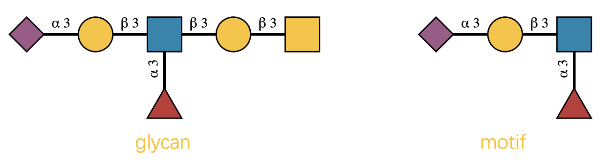

```{r, include = FALSE}
knitr::opts_chunk$set(
  collapse = TRUE,
  comment = "#>"
)
```

## What is a Glycan Motif? 🧬

Imagine you're looking at a complex glycan structure—those intricate branched molecules that decorate your cells.
Hidden within these molecular architectures are recurring patterns called "motifs."
Think of them as the molecular equivalent of architectural motifs: 
recognizable design elements that appear across different buildings (or in this case, 
different glycans).

A glycan motif is simply a substructure that appears in multiple glycans.
(Don't confuse this with protein motifs—we're talking about carbohydrates here! 🍭)
Some famous examples include the N-glycan core, 
Lewis X antigen, 
and the Tn antigen.

## Why Should You Care? 🤔

Here's where it gets exciting: 
these motifs aren't just decorative—they're functional.
They determine how cells interact, 
how pathogens bind, 
and how your immune system recognizes friend from foe.

This package, 
`glymotif`, 
is your computational microscope 🔬 for advanced glycan motif analysis.
It helps you answer two fundamental questions:

- **Does this glycan contain a specific motif?**
- **How many times does this motif appear?**

The best part? ✨
Everything works with vectors of glycans, 
so you can analyze hundreds or thousands at once.

**Important note:** This package builds on the powerful [glyrepr](https://github.com/glycoverse/glyrepr) package.
If you haven't used it before, 
we highly recommend checking out its [introduction](https://glycoverse.github.io/glyrepr/articles/glyrepr.html) first.

```{r setup}
library(glymotif)
```

## A Quick Challenge 🧩

Let's start with a visual puzzle.
Can you tell if the glycan on the left contains the motif on the right?



If you said "yes," 
congratulations—you have a keen eye! 👀
But what if I gave you 500 glycans and 20 motifs to check?
That's where `glymotif` becomes indispensable.

Let's see it in action using IUPAC-condensed notation 
(the standard text format for glycans in the `glycoverse` ecosystem).
If this notation looks unfamiliar, 
don't worry—check out [this helpful guide](https://glycoverse.github.io/glyrepr/articles/iupac.html) first.

```{r}
glycans <- c(
  "Neu5Ac(a2-3)Gal(b1-3)[Fuc(a1-3)]GlcNAc(b1-3)Gal(b1-3)GalNAc(b1-",
  "Neu5Ac(a2-?)Gal(b1-3)[Fuc(a1-3)]GlcNAc(b1-",
  "Man(b1-4)GlcNAc(b1-4)[Fuc(a1-6)]GlcNAc(b1-",
  "Gal(b1-3)GalNAc(b1-",
  "Neu5Ac9Ac(a2-3)Gal(b1-4)GlcNAc(b1-"
)
motif <- "Neu5Ac(a2-3)Gal(b1-3)[Fuc(a1-3)]GlcNAc(b1-"
have_motif(glycans, motif)
```

Pretty neat, 
right? 😎

## Your Toolkit: Four Essential Functions 🛠️

`glymotif` provides four core functions that work together like a well-designed instrument panel:

- **`have_motif()`**: Returns TRUE/FALSE for each glycan—does it contain the motif?
- **`count_motif()`**: Returns numbers—how many times does the motif appear?
- **`have_motifs()`**: The plural version—checks multiple motifs at once, 
returns a matrix
- **`count_motifs()`**: Counts multiple motifs simultaneously, 
returns a matrix

### Why the Plural Functions? 🤷‍♀️

You might wonder: 
"Why not just use `have_motif()` in a loop?"
Great question! 💭
There are two compelling reasons:

**1. Predictable output format** 📊
Just like the `purrr` package has different `map` functions for different return types, 
our functions guarantee consistent outputs.
The singular functions return vectors; 
the plural functions return matrices.
No surprises, 
no wrestling with data types.

**2. Optimized performance** ⚡
The plural functions are specifically optimized for multiple motifs.
They're significantly faster than looping or using `purrr::map()` because they avoid redundant computations.

### Seeing Them in Action

Let's define some motifs to work with:

```{r}
motifs <- c(
  "Neu5Ac(a2-3)Gal(b1-3)[Fuc(a1-3)]GlcNAc(b1-",
  "Fuc(a1-",
  "Gal(b1-3)GalNAc(b1-"
)
```

All functions follow the same pattern:

- **First argument:** your glycans (as IUPAC strings or a `glyrepr::glycan_structure()` object)
- **Second argument:** your motif(s) (IUPAC strings, 
a `glyrepr::glycan_structure()` object, 
or predefined motif names)

```{r}
have_motif(glycans, motif)
```

```{r}
unname(have_motifs(glycans, motifs))  # Removing names for cleaner display
```

**Pro tip:** 💡 You don't need to memorize complex IUPAC strings!
Use predefined motif names instead:

```{r}
all_motifs()[1:10]
```

```{r}
have_motif(glycans, "Type 2 LN2")
```

## The Art and Science of Motif Matching 🎨🔬

Now we enter the fascinating complexity of motif recognition.
You might think: 
"It's just pattern matching, 
right?"
Well, 
not quite. 🤨

Real-world glycan data is beautifully messy:

- **Missing linkage information**: Sometimes we only know "there's a link" but not its exact type
- **Generic monosaccharides**: Mass spectrometry might only tell us "Hex" instead of "Glucose"
- **Chemical modifications**: Sulfation, acetylation, and other decorations add complexity
- **Alignment constraints**: Some motifs only "count" when they appear in specific locations

Consider the Tn antigen—it's just a single GalNAc residue.
But it shouldn't match every GalNAc in a complex N-glycan, 
should it?
Context matters.

Similarly, 
an O-glycan core motif should only be recognized at the reducing end, 
not buried in the middle of a structure.

`glymotif` handles all these complexities through its sophisticated matching engine.
The algorithm considers structural context, 
chemical modifications, 
and biological relevance to make intelligent matching decisions.

## What's next?

- Want to known all the details about motif matching rules? [Here](https://glycoverse.github.io/glymotif/articles/motif-matching.html)
- Working with `glyexp::experiment()`? [Here](https://glycoverse.github.io/glymotif/articles/with-exp.html)
- Dealing with N-glycans? [Here](https://glycoverse.github.io/glymotif/articles/n-glycans.html)

## Standing on the Shoulders of Giants 🏔️

This work wouldn't be possible without the inspiration and groundwork laid by several excellent projects:

- [glycowork](https://github.com/BojarLab/glycowork): A comprehensive Python toolkit for glycan analysis 🐍
- [GlyCompare](https://github.com/LewisLabUCSD/GlyCompare): Advanced glycan comparison algorithms 🔬

We're proud to contribute to this growing ecosystem of computational glycobiology tools! 🌱