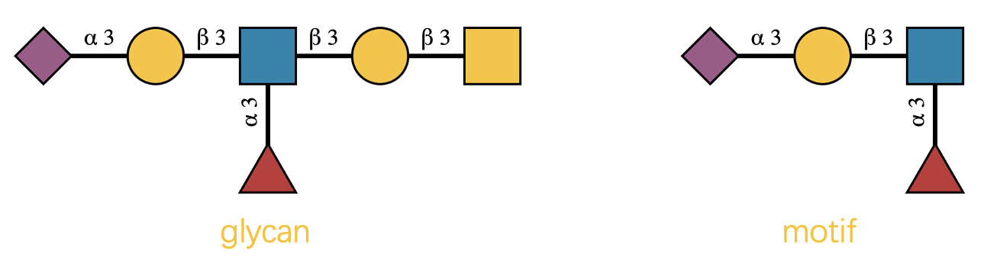

```{r, include = FALSE}
knitr::opts_chunk$set(
  collapse = TRUE,
  comment = "#>"
)
```

## What is a Glycan Motif?

Glycans are branched molecules that appear on cells and biomolecules.
Within these structures,
recurring patterns are called "motifs."
In this package,
a motif is a recognizable substructure that may appear across different glycans.

A glycan motif is simply a substructure that appears in multiple glycans.
(This is separate from protein motifs; here we are working with carbohydrates.)
Some famous examples include the N-glycan core, 
Lewis X antigen, 
and the Tn antigen.

## Why Motifs Matter

Motifs are not just labels for repeated structure.
They can be functional.
They determine how cells interact, 
how pathogens bind, 
and how your immune system recognizes friend from foe.

This package, 
`glymotif`, 
provides tools for glycan motif analysis.
It helps you answer two questions:

- **Does this glycan contain a specific motif?**
- **How many times does this motif appear?**

Everything works with vectors of glycans, 
so you can analyze hundreds or thousands at once.

**Important note:** This package builds on the [glyrepr](https://github.com/glycoverse/glyrepr) package.
If you haven't used it before, 
start with its [introduction](https://glycoverse.github.io/glyrepr/articles/glyrepr.html).

```{r setup}
library(glyrepr)
library(glymotif)
```

## A Quick Challenge

Let's start with a visual puzzle.
Can you tell if the glycan on the left contains the motif on the right?



If you said "yes," 
you are reading the structure correctly.
But what if I gave you 500 glycans and 20 motifs to check?
That is where `glymotif` becomes useful.

Let's see it in action using IUPAC-condensed notation 
(the standard text format for glycans in the `glycoverse` ecosystem).
If this notation looks unfamiliar, 
start with [this guide](https://glycoverse.github.io/glyrepr/articles/iupac.html).

```{r}
glycans <- c(
  "Neu5Ac(a2-3)Gal(b1-3)[Fuc(a1-6)]GlcNAc(b1-3)Gal(b1-3)GalNAc(b1-",
  "Neu5Ac(a2-?)Gal(b1-3)[Fuc(a1-6)]GlcNAc(b1-",
  "Man(b1-4)GlcNAc(b1-4)[Fuc(a1-3)]GlcNAc(b1-",
  "Gal(b1-3)GalNAc(b1-",
  "Neu5Ac9Ac(a2-3)Gal(b1-4)GlcNAc(b1-"
)
motif <- "Neu5Ac(a2-3)Gal(b1-3)[Fuc(a1-6)]GlcNAc(b1-"
have_motif(glycans, motif)
```

The result shows which glycans contain the motif.

## Your Toolkit: Four Essential Functions

`glymotif` provides four core functions:

- **`have_motif()`**: Returns TRUE/FALSE for each glycan—does it contain the motif?
- **`count_motif()`**: Returns numbers—how many times does the motif appear?
- **`have_motifs()`**: The plural version—checks multiple motifs at once, 
returns a matrix
- **`count_motifs()`**: Counts multiple motifs simultaneously, 
returns a matrix

### Why the Plural Functions?

You might wonder: 
"Why not just use `have_motif()` in a loop?"
There are two reasons:

**1. Predictable output format**
Just like the `purrr` package has different `map` functions for different return types, 
our functions guarantee consistent outputs.
The singular functions return vectors; 
the plural functions return matrices.
No surprises, 
and no extra work reshaping return values.

**2. Optimized performance**
The plural functions are specifically optimized for multiple motifs.
They're significantly faster than looping or using `purrr::map()` because they avoid redundant computations.

### Seeing Them in Action

Let's define some motifs to work with:

```{r}
motifs <- c(
  "Neu5Ac(a2-3)Gal(b1-3)[Fuc(a1-6)]GlcNAc(b1-",
  "Fuc(a1-",
  "Gal(b1-3)GalNAc(b1-"
)
```

All functions follow the same pattern:

- **First argument:** your glycans (as IUPAC strings or a `glyrepr::glycan_structure()` object)
- **Second argument:** your motif(s) (IUPAC strings, 
a `glyrepr::glycan_structure()` object, 
or predefined motif names)

```{r}
have_motif(glycans, motif)
```

```{r}
unname(have_motifs(glycans, motifs))  # Removing names for cleaner display
```

**Tip:** You don't need to memorize complex IUPAC strings.
Use predefined motif names instead:

```{r}
db_motifs()[1:10]
```

```{r}
have_motif(glycans, "Type 2 LN2")
```

**Caution:** If you are using predefined motif names,
you should be aware that all of the built-in motifs have "intact" structure level.
See the "Handling Structural Ambiguity" section below for more details.

## Motif Matching Rules

Motif recognition has a few important details.
You might think: 
"It's just pattern matching, 
right?"
Well, 
not quite.

Real-world glycan data is often incomplete or heterogeneous:

- **Missing linkage information**: Sometimes we only know "there's a link" but not its exact type
- **Generic monosaccharides**: Mass spectrometry might only tell us "Hex" instead of "Glucose"
- **Chemical modifications**: Sulfation, acetylation, and other decorations add complexity
- **Alignment constraints**: Some motifs only "count" when they appear in specific locations

Consider the Tn antigen—it's just a single GalNAc residue.
But it shouldn't match every GalNAc in a complex N-glycan, 
should it?
Context matters.

Similarly, 
an O-glycan core motif should only be recognized at the reducing end, 
not buried in the middle of a structure.

`glymotif` handles these cases through its matching engine.
The algorithm considers structural context, 
chemical modifications, 
and biological relevance when deciding whether a motif is present.

## Handling Structural Ambiguity

Real-world glycan data often comes with structural ambiguity.
Mass spectrometry might only tell us "HexNAc" instead of "GlcNAc",
or linkage analysis might yield "a1-?" instead of "a1-6".
These uncertainties are common in experimental glycomics and glycoproteomics.

### How `glymotif` Handles Structural Ambiguity

`glymotif` handles these ambiguities with a fundamental principle:
**A glycan cannot be more ambiguous than the motif it's being matched against.**

```{r}
# Ambiguous linkages won't match specific ones
have_motif("Gal(??-?)GalNAc(??-", "Gal(a1-6)GalNAc(a1-")

# Generic monosaccharides won't match specific ones
have_motif("Hex(a1-6)HexNAc(a1-", "Gal(a1-6)GalNAc(a1-")
```

This behavior is **intentional**, not a bug.
True motif identification requires confidence:
structural possibilities alone aren't sufficient evidence.

### Working Around Ambiguity

If you're getting unexpected `FALSE` results with `have_motif()`
(especially when using built-in motifs with ambiguous glycans),
the first thing you should do is to check the structure level of the glycan and the motif.
You can use `glyrepr::get_structure_level()` to help you with this task.

```{r}
# get_structure_level() expects a glycan structure vector
get_structure_level(as_glycan_structure(c("Gal(??-?)GalNAc(??-", "Gal(a1-6)GalNAc(a1-")))
```

here are two strategies:

**1. Ignore linkage information** when linkages are unreliable:

```{r}
have_motif("Gal(??-?)GalNAc(??-", "Gal(a1-6)GalNAc(a1-", ignore_linkages = TRUE)
```

**2. Convert motifs to generic forms** to match the generic monosaccharides of your data:

```{r}
motif <- glyparse::auto_parse("Gal(a1-6)GalNAc(a1-")  # First, create a `glycan_structure()`
motif <- glyrepr::convert_to_generic(motif)  # Then, convert to generic
have_motif("Hex(a1-6)HexNAc(a1-", motif)
```

**Important:** When using these workarounds,
interpret your results with appropriate caution.
You're trading specificity for coverage.

## Dynamic Motif Detection

While matching against a database of known motifs is useful,
sometimes you want to discover what motifs are actually present in your specific dataset,
even those not in the database.
This is where dynamic motif detection comes in.

Instead of asking "Is motif A here?", we ask "What motifs are here?".

### `extract_motif()`

`extract_motif()` allows you to detect all motifs appears in a set of glycans.
Take a simple O-glycan for example:

```{r}
extract_motif("Gal(b1-3)[GlcNAc(b1-6)]GalNAc(a1-")
```

This function works vectorizedly, and only a unique set of motifs will be returned.

```{r}
extract_motif(c(
  "Gal(b1-3)[GlcNAc(b1-6)]GalNAc(a1-",
  "Gal(b1-3)GalNAc(a1-"
))
```

As you can imagine, the number of possible dynamic motifs in a large glycan can be very large.
Therefore, `extract_motif()` has a `max_size` parameter restricting the size of motifs to be extracted.
By default, `max_size = 3`, this restricts the motifs to be extracted to those with at most 3 monosaccharides.

```{r}
extract_motif("Glc(a1-2)Glc(a1-2)Glc(a1-2)Glc(a1-")
```

You can increase the `max_size` to extract larger motifs.

```{r}
extract_motif("Glc(a1-2)Glc(a1-2)Glc(a1-2)Glc(a1-", max_size = 4)
```

However, increase it progressively with caution,
as the computation time can increase exponentially.

### `extract_branch_motif()`

`extract_motif()` works well with O-glycans, which are very versatile and not very large.
However, using it on N-glycans might be less effective and less meaningful,
as the core pattern of an N-glycan is very restricted by the biosynthesis rules.
The only diversity comes from the antennae.
Therefore, we provide `extract_branch_motif()` to extract only the branching motifs.

```{r}
glycans <- c(
  "Neu5Ac(a2-3)Gal(b1-4)GlcNAc(b1-2)Man(a1-3)[Gal(b1-4)GlcNAc(b1-2)Man(a1-6)]Man(b1-4)GlcNAc(a1-4)GlcNAc(b1-",
  "Neu5Ac(a2-3)Gal(b1-4)GlcNAc(b1-2)Man(a1-3)[Neu5Ac(a2-6)Gal(b1-4)GlcNAc(b1-2)Man(a1-6)]Man(b1-4)GlcNAc(a1-4)GlcNAc(b1-",
  "Gal(b1-4)GlcNAc(b1-2)Man(a1-3)[GlcNAc(b1-2)Man(a1-6)]Man(b1-4)GlcNAc(a1-4)GlcNAc(b1-"
)

extract_branch_motif(glycans)
```

### `dynamic_motifs()` and `branch_motifs()`

`extract_motif()` and `extract_branch_motif()` are useful if you only want to know what motifs exist.
However, when using dynamic motifs in motif matching functions like `have_motifs()`,
additional intricacies should be taken into account.

For these cases, you should pass the `dynamic_motifs()` or the `branch_motifs()` helpers
to the `motifs` argument of supported functions instead.
They are just empty sentinel objects to inform the passed functions to perform dynamic motif matching.

```{r}
count_motifs(glycans, branch_motifs())
```

Functions supporting `dynamic_motifs()` and `branch_motifs()`:
`have_motifs()`, `count_motifs()`, `match_motifs()`, `add_motifs_lgl()`, and `add_motifs_int()`.

## What's Next?

- Want more detail about motif matching rules? See [Motif Matching Rules](https://glycoverse.github.io/glymotif/articles/motif-matching.html).
- Working with `glyexp::experiment()`? See [Working with glyexp](https://glycoverse.github.io/glymotif/articles/with-exp.html).

## Related Projects

This work builds on ideas and groundwork from several excellent projects:

- [glycowork](https://github.com/BojarLab/glycowork): A comprehensive Python toolkit for glycan analysis
- [GlyCompare](https://github.com/LewisLabUCSD/GlyCompare): Advanced glycan comparison algorithms

`glymotif` is one contribution to this growing ecosystem of computational glycobiology tools.
