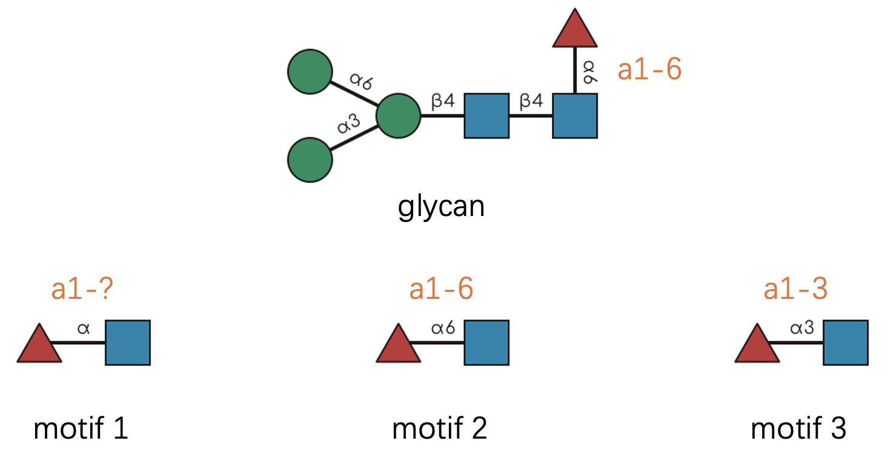

```{r, include = FALSE}
knitr::opts_chunk$set(
  collapse = TRUE,
  comment = "#>"
)
```

## Welcome to the Heart of `glymotif` 🔬

Ever wondered what's happening under the hood when you call `have_motif()` or `count_motif()`?
You're about to embark on a fascinating journey through the intricate world of glycan pattern recognition! 🚀

In this vignette,
we'll demystify the sophisticated algorithms that power all `glymotif` functions.
The rules are rooted in the comprehensive [GlycoMotif](https://glycomotif.glyomics.org/) database,
but we've tailored them specifically for practical glycan analysis workflows.

**A quick note:** 📝
We use IUPAC-condensed glycan text representations throughout. 
If this format looks like hieroglyphics to you,
take a detour to [this excellent primer](https://glycoverse.github.io/glyrepr/articles/iupac.html) first.
Trust us—it's worth it!

```{r setup}
library(glymotif)
```

## The Biological Reality: Defining Our Terms 🧬

Before diving into the technical details,
let's establish some clarity about what we're actually matching.

Throughout this vignette,
**"glycan"** refers to a complete carbohydrate structure—the whole molecular tree,
from its reducing end (often attached to proteins or lipids) to its non-reducing termini.

**"Motif"**, on the other hand,
is any structurally meaningful pattern within that tree.
It could be:

- A single monosaccharide 🍯
- A small oligosaccharide unit 🔗
- An entire glycan structure 🌳

Our central question is beautifully simple:
**Does the given glycan contain this particular motif?**

Let's start with a visual example that illustrates this concept:


Looking at this diagram,
we can confidently say "the glycan contains the motif with exactly 1 occurrence."
The presence part is determined by `have_motif()`,
while the counting aspect is handled by `count_motif()`.

```{r}
glycan <- "Neu5Ac(a2-3)Gal(b1-3)[Fuc(a1-3)]GlcNAc(b1-3)Gal(b1-3)GalNAc(b1-"
motif <- "Neu5Ac(a2-3)Gal(b1-3)[Fuc(a1-3)]GlcNAc(b1-"

print(paste0("Does the glycan have the motif? ", have_motif(glycan, motif)))
print(paste0("How many occurrences of the motif are there in the glycan? ", count_motif(glycan, motif)))
```

## Why Not Just Use `str_detect()`? 🤔

You might be thinking:
"This example looks straightforward—why not just use string matching?"
Great question! 💭
Let's test that hypothesis:

```{r}
stringr::str_detect(glycan, stringr::fixed(motif))
```

Indeed,
it works for this simple case.
But here's where the plot thickens... 🎭

Real-world glycan analysis is gloriously complex.
Consider these challenging scenarios:

- **Complex branching patterns** with multiple attachment points 🌿
- **Ambiguous linkage annotations** where details are missing or uncertain ❓
- **Generic monosaccharide assignments** from mass spectrometry data 🔍
- **Chemical modifications and substituents** that add layers of complexity ⚗️
- **Positional constraints** where context determines biological meaning 📍
- **Reducing end anomers** that affect molecular recognition 🔄

Writing regular expressions to handle all these nuances?
That's a one-way ticket to debugging hell! 😱
That's precisely why we need sophisticated computational tools for this task.

## Demystifying the Complexity: One Rule at a Time 🧩

The `have_motifs()` and `count_motifs()` functions return matrices with meaningful row and column names.
For clarity in our demonstrations,
let's create simplified wrapper functions:

```{r}
# You don't have to understand this.
have_motifs_simple <- function(glycan, motifs, ...) {
  unname(have_motifs(glycan, motifs, ...)[1, ])
}

count_motifs_simple <- function(glycan, motifs, ...) {
  unname(count_motifs(glycan, motifs, ...)[1, ])
}
```

Now,
let's explore each matching rule systematically.

### Rule 1: Branching Logic 🌳

Branching patterns are actually quite intuitive once you think of glycans as tree structures.
Let's examine this with a concrete example:


Let's check three distinct motifs,
each representing a different level of structural complexity:

1. "Gal(??-" - a single monosaccharide building block
2. "Fuc(??-?)GlcNAc(??-" - a disaccharide with ambiguous linkage
3. The complete glycan structure itself

```{r}
glycan <- "Neu5Ac(??-?)Gal(??-?)[Fuc(??-?)]GlcNAc(??-?)Gal(??-?)GalNAc(b1-"
motifs <- c(
  "Gal(??-",
  "Fuc(??-?)GlcNAc(??-",
  glycan
)
count_motifs_simple(glycan, motifs)
```

**The computational perspective:** 🖥️
Behind the scenes,
we're performing subgraph isomorphism matching.
Glycans and motifs are represented as mathematical graphs,
and we're searching for structural embeddings.

**But there are two crucial distinctions from standard graph theory:**

**First, directionality matters.** ⬅️➡️
The reducing end (right side) and non-reducing end (left side) are biologically distinct.
Direction affects function:

```{r}
motifs <- c("Fuc(??-?)GlcNAc(??-", "GlcNAc(??-?)Fuc(??-")
have_motifs_simple(glycan, motifs)
```

**Second, biological equivalence trumps mathematical multiplicity.** 🔄
When multiple mathematically distinct matches have identical biological meaning,
we count them as one.

Consider this elegant example:


Technically,
this motif has two valid subgraph matches within the glycan 
("A-a, B-b, C-c" and "A-b, B-a, C-c").
But from a biological perspective,
these matches are equivalent—the specific assignment of mannose residues doesn't matter.
Therefore,
`count_motif()` reports exactly one match:

```{r}
glycan <- "Man(??-?)[Man(??-?)]Man(??-?)GlcNAc(??-?)GlcNAc(??-"
motif <- "Man(??-?)[Man(??-?)]Man(??-"
count_motif(glycan, motif)
```

### Rule 2: Linkage Flexibility 🔗

Linkage information in glycomics can be frustratingly incomplete.
You might encounter patterns like "??-6", "a2-?", or complete unknowns.
Our matching philosophy is elegantly simple:

**The glycan cannot be more ambiguous than the motif.**

This means a concrete linkage like "a2-6" in your glycan data will match:

- "a2-6" (exact match) ✅
- "a2-?" (position-specific, anomer flexible) ✅  
- "??-6" (anomer-specific, position flexible) ✅
- "??-?" (completely flexible wildcard) ✅

But an ambiguous linkage like "a2-?" will only match equally or more flexible patterns in the motif.

Let's see this in practice:



**Pro tip about notation:** 💡
Following [SNFG](https://www.ncbi.nlm.nih.gov/glycans/snfg.html) conventions,
we often abbreviate linkages by omitting the anomeric carbon number.
So "a1-6" becomes simply "a6" since the anomeric position is typically known.

```{r}
glycan <- "Man(a1-3)[Man(a1-6)]Man(b1-4)GlcNAc(b1-4)[Fuc(a1-6)]GlcNAc(b1-"
motifs <- c(
  "Fuc(a1-?)GlcNAc(b1-",  # Motif 1: anomer known, position flexible
  "Fuc(a1-6)GlcNAc(b1-",  # Motif 2: exact linkage match
  "Fuc(a1-3)GlcNAc(b1-"   # Motif 3: wrong position specification
)
have_motifs_simple(glycan, motifs)
```

### Rule 3: Monosaccharide Resolution 🔬

Mass spectrometry often provides incomplete monosaccharide identification.
You might know there's a hexose present but not whether it's glucose,
galactose,
or mannose.

We distinguish between two resolution levels:

- **Concrete monosaccharides**: Structurally specific (e.g., "Gal", "Man", "Glc")
- **Generic monosaccharides**: Compositionally defined (e.g., "Hex", "HexNAc", "dHex")

The matching rule mirrors our linkage philosophy:
**The glycan cannot be more ambiguous than the motif.**

Specifically:

- Concrete monosaccharides in glycans can match both concrete and generic motifs ✅
- Generic monosaccharides in glycans can only match generic motifs ✅

```{r}
mat <- have_motifs(glycans = c("Hex(a1-", "Man(a1-"), motifs = c("Hex(a1-", "Man(a1-"))
rownames(mat) <- paste0(rownames(mat), "_glycan")
colnames(mat) <- paste0(colnames(mat), "_motif")
mat
```

### Rule 4: Chemical Modifications 🧪

Real glycans are often decorated with chemical modifications—acetylation,
sulfation,
methylation,
and more.
These substituents have two components:
position (where they're attached) and identity (what they are).

For example,
"Neu5Ac9Ac" represents N-acetylneuraminic acid with an additional 9-O-acetyl group.

The matching rules are straightforward but powerful:

1. **Identity matching**: If the glycan has a substituent,
the motif must have the same type to match
2. **Position flexibility**: The glycan cannot be more ambiguous than the motif regarding position


Let's see this in action:

```{r}
glycans <- c("Neu5Ac9Ac(a2-", "Neu5Ac?Ac(a2-", "Neu5Ac(a2-")
motifs <- c("Neu5Ac9Ac(a2-", "Neu5Ac?Ac(a2-", "Neu5Ac(a2-")
mat <- have_motifs(glycans, motifs)
rownames(mat) <- paste0("glycan_", 1:3)
colnames(mat) <- paste0("motif_", 1:3)
mat
```

### Rule 5: Alignment Constraints 📍

Here's where biology meets computation in fascinating ways! 🎯
Some motifs are only meaningful in specific structural contexts.

Consider the N-glycan core—it's biologically significant only when positioned at the reducing end.
Similarly,
the Tn antigen (simply GalNAc) should represent the entire O-glycan structure,
not just any GalNAc residue buried within a larger molecule.

Following [GlycoMotif](https://glycomotif.glyomics.org/) standards,
we recognize four alignment types:

- **"substructure"**: The motif can appear anywhere within the glycan 🔍
- **"core"**: Must align with a connected subtree at the reducing end 🌱  
- **"terminal"**: Must align with a connected subtree at non-reducing ends 🍃
- **"whole"**: Must match the entire glycan structure 🌳


Let's verify these behaviors computationally:

```{r}
glycan <- "Gal(a1-3)Gal(a1-4)Gal(a1-6)Gal(a1-"
motifs <- c(
  "Gal(a1-3)Gal(a1-4)Gal(a1-6)Gal(a1-",  # motif 1: complete structure
  "Gal(a1-3)Gal(a1-4)Gal(a1-",           # motif 2: terminal branch
           "Gal(a1-4)Gal(a1-6)Gal(a1-",  # motif 3: reducing-end subtree
           "Gal(a1-4)Gal(a1-"            # motif 4: internal fragment
)
alignments <- c("substructure", "whole", "core", "terminal")
mat <- do.call(cbind, purrr::map(alignments, ~ have_motifs_simple(glycan, motifs, alignment = .x)))
colnames(mat) <- alignments
rownames(mat) <- paste0("motif_", 1:4)
mat
```

### Rule 6: Reducing End Anomers 🔄

The reducing end of a glycan—that special monosaccharide connected to proteins or lipids—deserves special attention.
Its anomeric configuration can significantly impact biological function.

The matching behavior depends on motif alignment:

**When the motif aligns away from the reducing end:**
The motif's "reducing end" (really just its rightmost residue) is matched against the corresponding internal linkage.

```{r}
glycan <- "Gal(a1-3)GalNAc(b1-"
motifs <- c("Gal(a1-", "Gal(b1-")
have_motifs_simple(glycan, motifs)
```

**When the motif aligns at the reducing end:**
Direct comparison with the glycan's actual reducing end anomer.

```{r}
glycan <- "Gal(a1-3)GalNAc(b1-"
motifs <- c("GalNAc(a1-", "GalNAc(b1-")
have_motifs_simple(glycan, motifs)
```

## The Big Picture: Why This Complexity Matters 🌟

You might be wondering:
"Why all these intricate rules?"
The answer lies in the beautiful complexity of biological systems. 🧬

Unlike artificial pattern matching,
biological recognition systems are:

- **Context-sensitive**: The same motif can have different meanings in different locations
- **Fault-tolerant**: Partial information should still yield meaningful results  
- **Hierarchically organized**: Generic patterns can be refined into specific ones
- **Chemically aware**: Modifications and substitutions are integral to function

By encoding these biological principles into our matching algorithms,
`glymotif` bridges the gap between computational analysis and biological reality.

Whether you're analyzing clinical glycomics data,
exploring evolutionary relationships,
or designing glycan-based therapeutics,
these sophisticated matching rules ensure your results are both computationally sound and biologically meaningful.

## Ready for More? 🚀

This deep dive into motif matching rules provides the foundation for understanding how `glymotif` works.
Armed with this knowledge,
you're ready to tackle even the most complex glycan analysis challenges!

For practical applications and real-world examples,
head back to the [Getting Started guide](glymotif.html).
For detailed function documentation,
explore the reference manual.

Happy glycan hunting! 🔍✨
